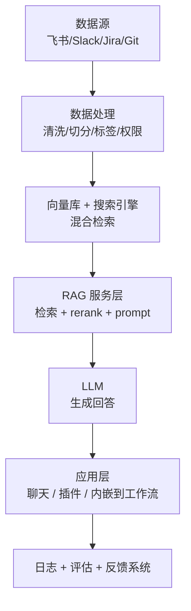

## 软考知识库wiki

计算机技术与软件专业技术资格（水平）考试，英文简称为**软考**，英文全称是 *Computer Technology and Software Professional Qualification (Level) Examination*，英文缩写为 **NCRE**（National Computer Rank Examination）。

## 企业有哪些结构？（简化版）
企业知识库 = RAG + 权限 + 数据治理 + 稳定性 + 可追责

## 个人知识库如何搭建？
skill：知识库索引管理、搜索查询、同步/导出（第三方平台）
+Python脚本

## 知识管理 / AI 笔记工具对比
| 工具 | 开发商 | 定位 | 核心特点 |
|------|--------|------|----------|
| **Cherry Studio** | 开源社区 (CherryHQ) | AI 生产力桌面客户端 | 聚合多种 LLM、300+ AI 助手、MCP 支持、跨平台 |
| **Notion** | Notion Labs | 全能工作空间 | Docs + Wiki + 项目管理 + 数据库、AI 写作/Agent |
| **Obsidian** | Obsidian 团队 | 本地优先 Markdown 笔记 | 双向链接、图谱、Canvas、数千插件、本地存储 |
| **ima copilot** | 腾讯 | AI 工作台 | AI 对话 + 个人知识库 + 知识库广场 |
| **Get 笔记** | 得到团队 | AI 笔记应用 | AI 语音/图片/链接记录、27 种方言识别、智能整理 |
| **NotebookLM** | Google | AI 研究助手 | 上传资料生成笔记/问答/时间线，基于个人资料库回答 |